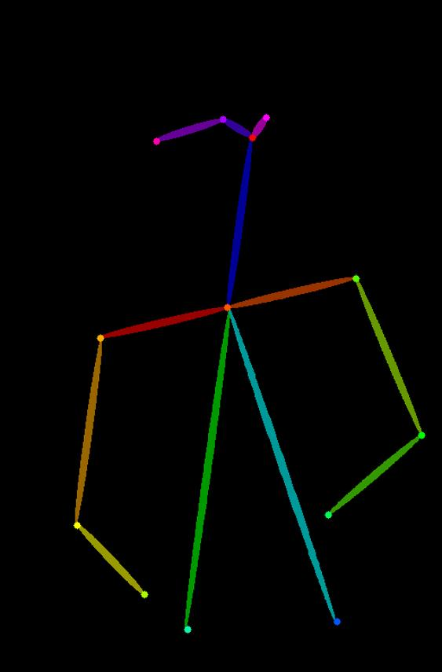

# Controlnet-Aux

## Pose Detector

```python
from PIL import Image
from vision_agent_tools.models.controlnet_aux import Image2Pose

# Path to your test image
test_image_path = "path/to/your/image.jpg"

# Load the image
image = Image.open(test_image_path)
# Create the Image2Pose instance
image_2_pose = Image2Pose()

# Run pose detection and get the results
results = image_2_pose(image)

# Optional: Save the result image (assuming results is a PIL Image)
# results.save("result.png")

print("Pose detection complete!")

```

<figure markdown="span">
  
  <figcaption>Pose Detection Result</figcaption>
</figure>


::: vision_agent_tools.models.controlnet_aux