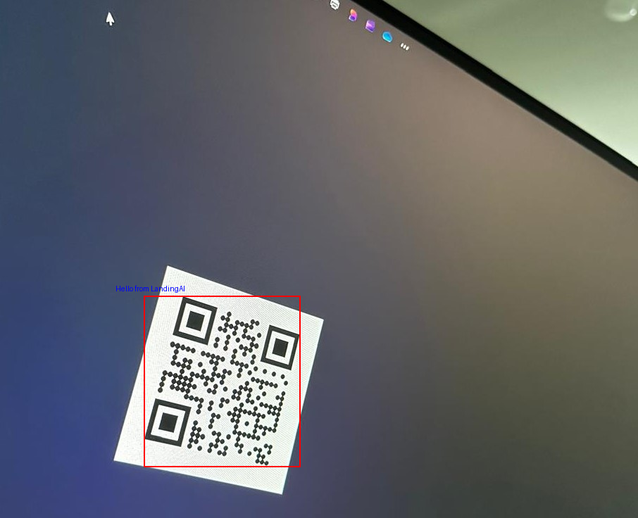

# QR Reader

Tool for detecting QR codes in images.

```python
from PIL import Image, ImageDraw

from vision_agent_tools.models.qr_reader import QRReader

# Open the image containing the QR code
image = Image.open("sample_qr_image.jpeg")

# Create a QR code reader object
qr_reader = QRReader()

# Detect QR codes in the image
detections = qr_reader(image)


if detections:

    detection = detections[0]
    draw = ImageDraw.Draw(image)

    # Print the detected text
    print(f"Decoded Text: {detection.text}")

    # Draw the bounding box
    x_min, y_min, x_max, y_max = (
        int(detection.bbox[0]),
        int(detection.bbox[1]),
        int(detection.bbox[2]),
        int(detection.bbox[3]),
    )
    draw.rectangle(((x_min, y_min), (x_max, y_max)), outline="red", width=2)

    # Draw the text on top of the image
    draw.text((x_min + 10, y_min - 10), detection.text, fill="blue", anchor="mm")
    image.show()
else:
    print("No QR codes detected in the image.")
```

<figure markdown="span">
  
  <figcaption>Displaying the Detection Result</figcaption>
</figure>


::: vision_agent_tools.models.qr_reader
